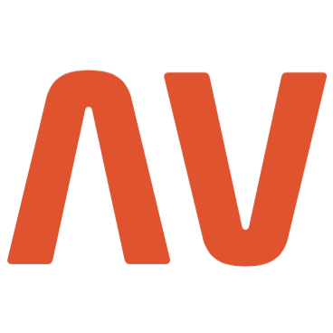

  
  

    <h1>Hi there 👋! </h1>
  

#### Who I am?
- A software developer based in **[Dhaka](https://en.wikipedia.org/wiki/Dhaka), [Bangladesh](https://en.wikipedia.org/wiki/Bangladesh).** 
- Have 4 years of hands-on experience in **software development, product design.**
- Developed products for **fintech, hrms, accounts, retail,** and **logistics** business domains.

#### What I'm doing?
- 🏢 Working at **[Walton Digi-Tech Industries Ltd](https://waltondigitech.com/)** as a **Senior Assistant Director**.
- 👨‍💻 Writing `Python` `SQL` `PHP` `HTML` `CSS` `JavaScript`.
- 🌍 Mostly active on  and the **Python & SQLAlchemy community**.
- 📚 Currently learning about **clean architecture**, **wasm**, and **advanced techniques of FastAPI**.
- 🛠️ Working on **microservices**, **fintech API**, **wasm**, and **React** professionally.
- 👯 Looking to collaborate on **python projects**.
- 🥰 Building **[Amar-Pay](https://github.com/jiaulislam/moneybag_backend)**, **[HRMS ETL](https://github.com/jiaulislam/db-pushpull-service)**, & many more as pet projects.

#### What I like to disscuss about? 
- 💬 Ask me about `web APIs` `system design` `scalability` `design patterns` `data structures` `coding speed hacks` `clean code` `feasibility` and `requirement analysis` `choice of frameworks` and `tech culture`.

#### What my skill set looks like?
- 🖥 **Front-end:** 
  - **📜 Languages:** • `👨‍🔧 JavaScript` • `🧚🏻‍♂️ HTML` • `👨🏻‍🎨 CSS` • `👨‍🔧 Bootstrap` • `👨‍🏭 SASS`
  - **🔬 Frameworks:**  • `🧙🏻 React` • `🧙🏻 next.js` 
  - **🌐 Web:** • [React](https://reactjs.org/)
  - **🗳 UI toolkits:** • [React MUI](https://mui.com/) • [shadcn UI](https://ui.shadcn.com/)
- 🗄️ **Back-end:**
  - **📜 Languages:** • `🧙🏻‍♂️ Python > 3.8`
  - **🔭 Frameworks:** • [FastAPI](https://fastapi.tiangolo.com/) • [Flask](https://flask.palletsprojects.com/en/2.2.x/) • [Django](https://www.djangoproject.com/) • [SQLAlchemy](https://www.sqlalchemy.org/)
  - **💾 Databases:** • [SQL Server](https://www.microsoft.com/en-us/sql-server/sql-server-2019) • [Oracle](https://www.oracle.com/) • [MySQL](https://www.mysql.com/)
  - **🎛 System architecture:** • [Monolithic](https://microservices.io/patterns/monolithic.html) • [Microservices](https://microservices.io/patterns/microservices.html)
  - **🔌 Communication protocols:** • [REST](https://docs.microsoft.com/en-us/azure/architecture/best-practices/api-design) • [TCP/IP](https://www.techtarget.com/searchnetworking/definition/TCP-IP) • [Web Socket](https://developer.mozilla.org/en-US/docs/Web/API/WebSockets_API)
- 🎡 **Software development ecosystem:**
  - **📁 Code repository:** • [Git](https://git-scm.com/) • [SVN](https://subversion.apache.org/) 
- 🧙‍♂️ **Coding pattern & principles:**
  - **⚒ Patterns:** • [MVC](https://en.wikipedia.org/wiki/Model%E2%80%93view%E2%80%93controller)  [MVT](https://www.geeksforgeeks.org/difference-between-mvc-and-mvt-design-patterns/) 
  - **🗜 Principles:** • [DRY](https://en.wikipedia.org/wiki/Don%27t_repeat_yourself#:~:text=%22Don%27t%20repeat%20yourself%22,data%20normalization%20to%20avoid%20redundancy.) • [ACID](https://en.wikipedia.org/wiki/ACID) • [DDD](https://en.wikipedia.org/wiki/Domain-driven_design) • [SOLID](https://www.digitalocean.com/community/conceptual_articles/s-o-l-i-d-the-first-five-principles-of-object-oriented-design)
  - **🕹 Frameworks:** • [FastAPI](https://fastapi.tiangolo.com/) • [Python 3.8 - 3.11](https://www.python.org/) • [SQLAlchemy](https://www.sqlalchemy.org/)
  
- **🏗️ Code editors:**
 
  
#### What's interesting about me?  
  - 😎 I love to **speak** really good **english**, discuss **new ideas**, and make people **smile**.
  - 🧐 I love to be very **precise** and **thorough**.
  - ✍️ I write about **why a certain code is written instead of what** in the comments.
  - ⏱️ I'm a **workaholic** and drink a lot of ☕ **coffee**.
  - 😅 I just can't **resist the urge** to **explore** a new **tech** released in the **Python** ecosystem.
<!--Github Stats-->

### :fire: My Stats :

#### What companies have I worked for?

  
  
  
  

#### What are my recent highlights?
- [featured-a-fintech-api-with **fastapi sqlalchemy mysql pydantic**](https://github.com/jiaulislam/moneybag_backend)
- [featured-a-etl-job-with **python sqlalchemy-core**](https://github.com/jiaulislam/db-pushpull-service)

#### How to get in touch with me?

 

